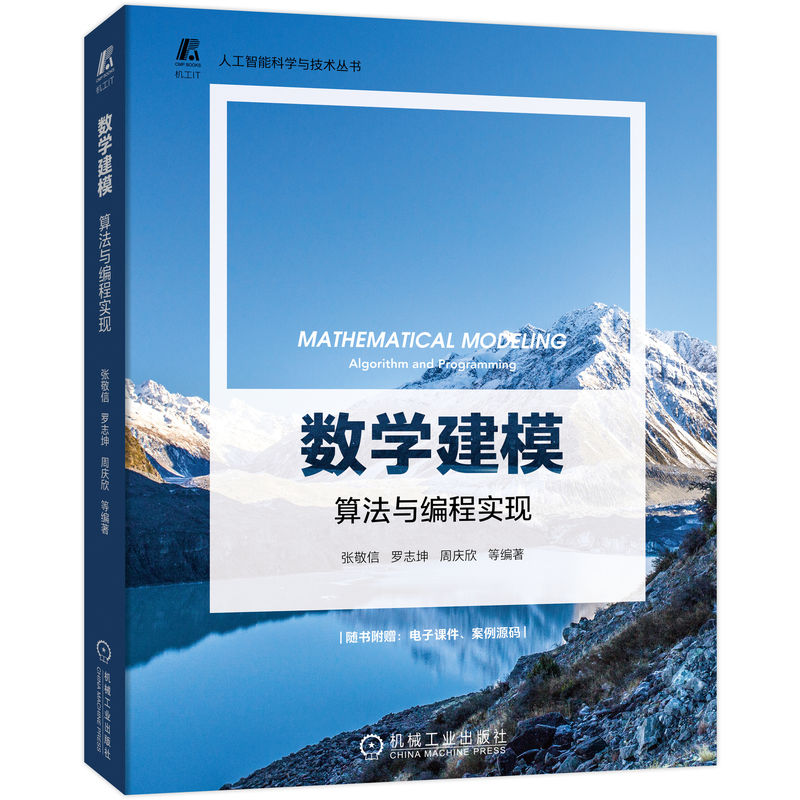
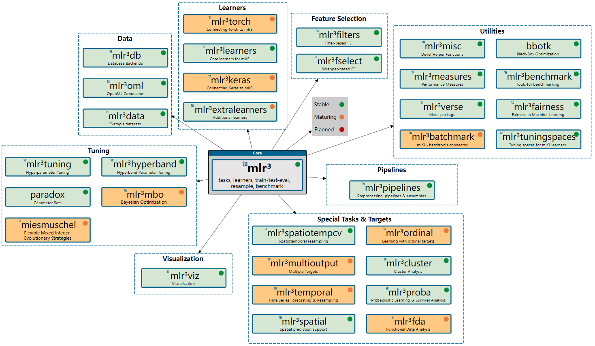
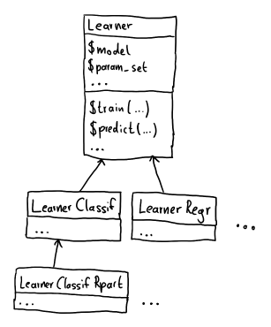
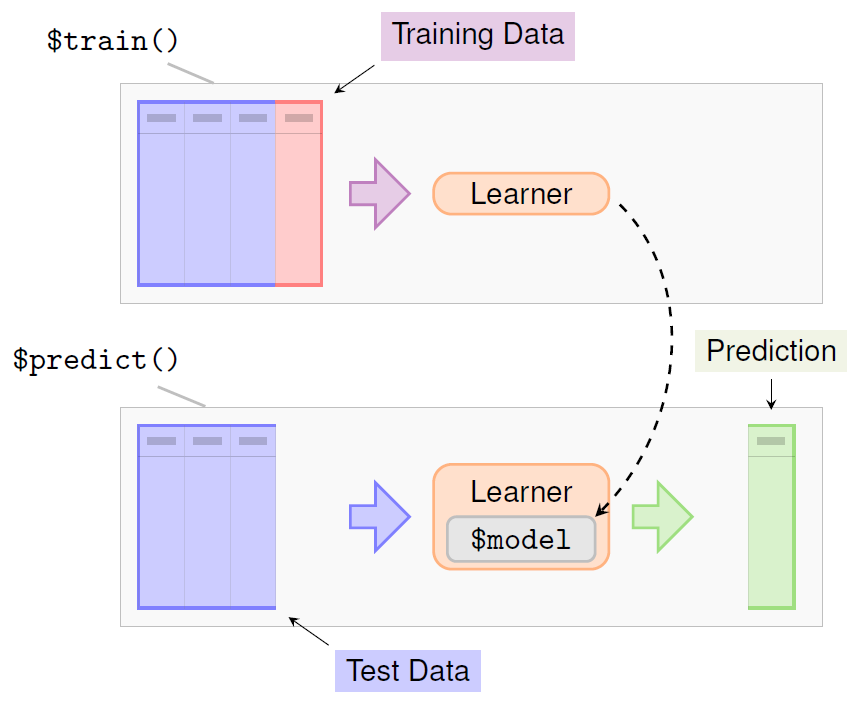
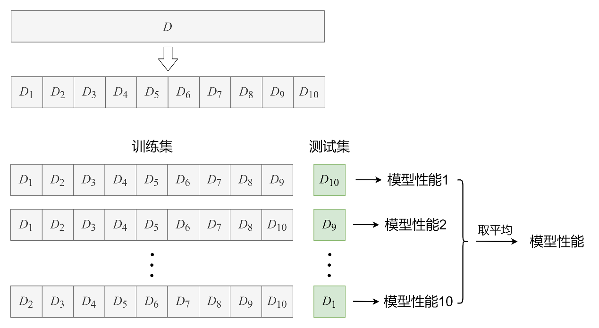
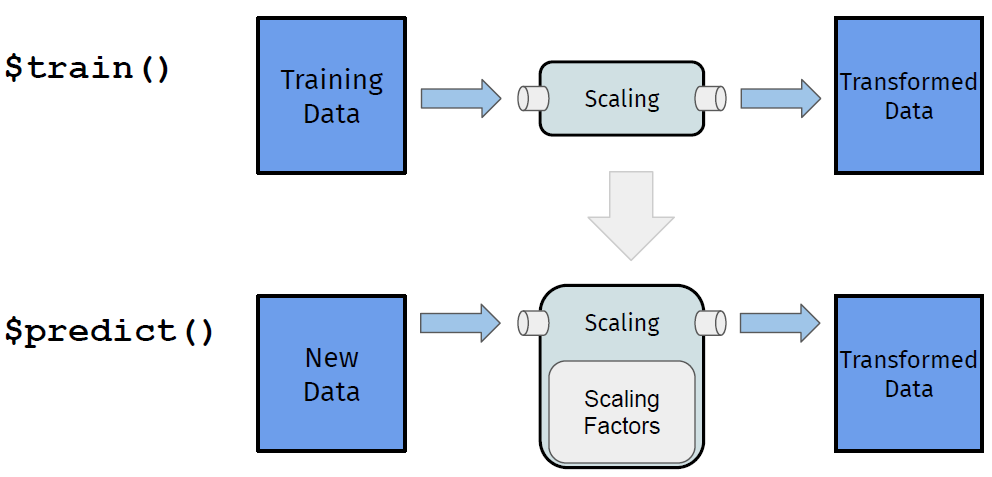
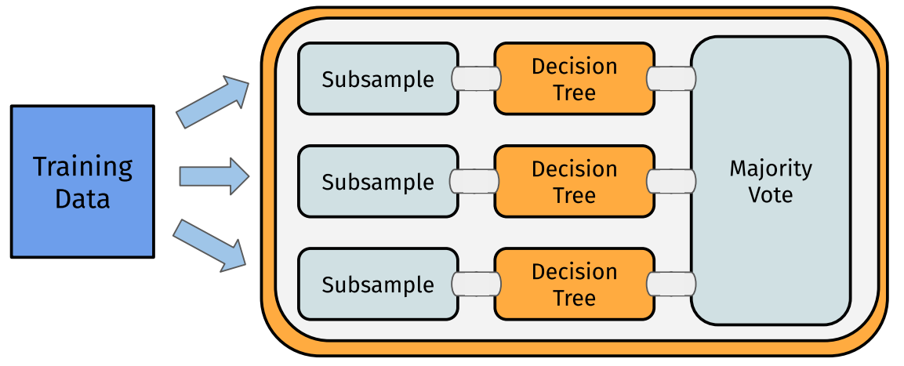
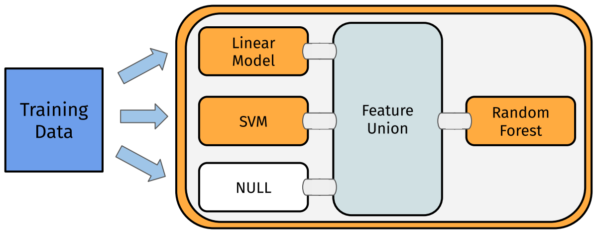
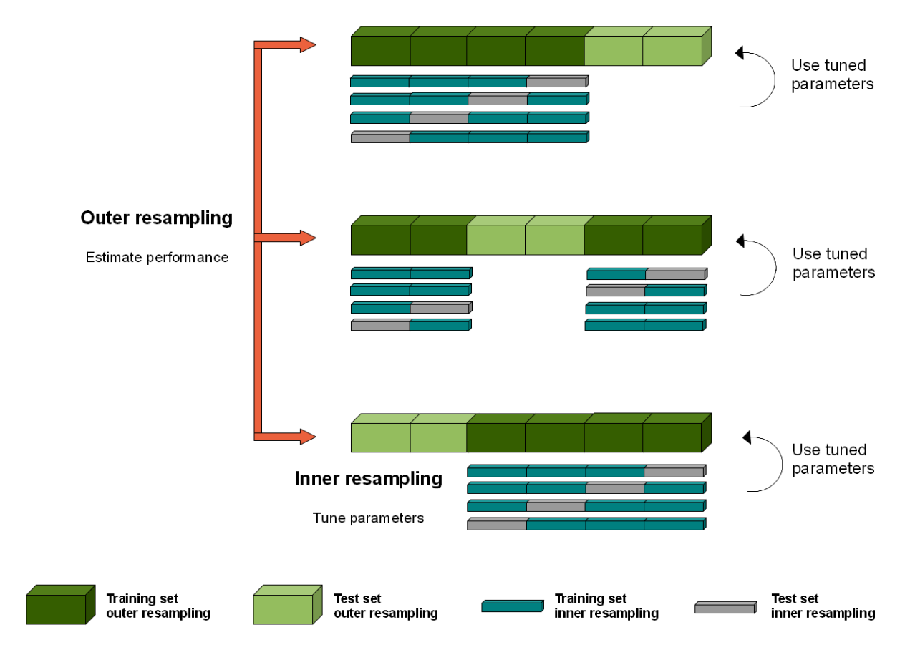
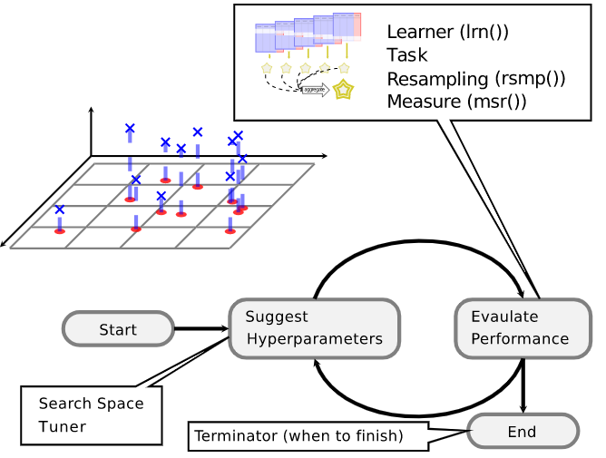

```{r setup, include=FALSE}
options(digits = 3)
knitr::opts_chunk$set(
  comment = "#>",
  echo = TRUE,
  message = FALSE,
  warning = FALSE,
  collapse = TRUE,
  out.width = "78%",
  fig.align = 'center',
  fig.asp = 0.618,  # 1 / phi
  fig.show = "hold"
)
```

```{r include=FALSE}
options(tibble.print_max = 5, tibble.print_min = 5)
library(showtext)
showtext_auto()
lgr::get_logger("mlr3")$set_threshold("warn")
lgr::get_logger("bbotk")$set_threshold("warn")
```

## 我的R书

```{r echo=FALSE, out.width=c("40%","25%")}
knitr::include_graphics(c("images/myRbook.png", "images/QR_code.png"))
```

- 电子抢读版今天上线（人邮）[异步社区](https://www.epubit.com/bookDetails?id=UB7db2c0db9f537&tabName=%E6%8A%A2%E8%AF%BB%E7%89%88&floorName=%E7%B2%BE%E9%80%89%E7%BA%B8%E4%B9%A6)
- 纸质版预计2022年12月10日上市（受北京疫情影响可能会晚约半个月）

## 我的另一本书

```{r echo=FALSE, out.width="55%"}

```

- 已于2022年7月上市，提供了R实现

## 一. mlr3verse 简介

- **曾经：**`R`中各个机器学习算法，都是单独的包实现，没有统一接口，不方便使用

- **过去：**整合机器学习算法的包：
  - `mlr`包
  - `caret`包
- **现在：**新一代整合机器学习算法的包，也是上面两个的进化版：
  - `mlr3verse`包（首推）：面向对象
  - `tidymodels`包：`tidyverse`一脉相承
- **模型（工业）部署：**`vetiver`包、`plumber`包

本讲只是对`mlr3verse`工作流点到为止，更多完整内容请参阅我最新梳理完成的[《`R`机器学习：`mlr3verse`技术手册》](https://gitee.com/zhjx19/rconf15)。

##

`mlr3verse`是最新、最先进的`R`机器学习框架，它基于面向对象`R6`语法和 `data.table`底层数据流（速度超快），支持`future`并行，支持搭建“图”流学习器，理念非常先进、功能非常强大。

`mlr3verse`整合了各种机器学习算法包，实现了统一、整洁的机器学习流程化操作，足以媲美`Python`的`scikit-learn`机器学习库。

加载包：

```{r}
library(mlr3verse) 
```

##

```{r echo=FALSE, out.width="100%", fig.align="center", fig.cap="mlr3verse生态"}

```

## 二. 基础知识

### 1. `R6`类：面向对象

支持继承、引用语法，将数据、方法绑定到一个对象。

```{r echo=FALSE, out.width="40%", fig.align="center", fig.cap="学习器对象"}

```

## 2. 任务：封装数据

任务是对表格数据的封装，自变量称为特征，因变量称为目标或结果变量。

- 目标决定了机器学习的“任务”：
  - 连续目标，就是回归；
  - 离散目标，就是分类；
  - 无目标，无监督学习（聚类、降维）

`mlr3`生态下还有若干特殊任务：生存分析任务、密度估计任务、时空分析任务、有序分析任务、函数分析任务、多标签分类任务、成本敏感分类任务、聚类任务。

##

- 创建任务：

```{r}
dat = tsk("german_credit")$data()
task = as_task_classif(dat, target = "credit_risk")
task
```

##

- 若不想使用全部特征

```{r}
task$select(cols = setdiff(task$feature_names, "telephone"))
```

- 划分训练集、测试集

```{r}
set.seed(1)
split = partition(task, ratio = 0.7)  
# 默认stratify = TRUE, 按目标变量分层
```

得到训练集、测试集的索引，分别在`split$train、split$test`中。

## 3. 学习器：封装算法

`mlr3`将算法封装在学习器中，提供了统一的方便接口，算法实现整合自相应的算法包（需要安装）。

```{r}
# 选择随机森林分类学习器, 需要ranger包
learner = lrn("classif.ranger", num.trees = 100, 
              predict_type = "prob")
learner
```

##

```{r echo=FALSE, out.width="75%", fig.align="center", fig.cap="学习器工作流程"}

```

##

- 在训练集上训练模型

```{r}
learner$train(task, row_ids = split$train)
learner$model
```

##

- 在测试集上做预测

```{r}
prediction = learner$predict(task, row_ids = split$test)
prediction
```

## 4. 性能评估

训练集上训练好的模型性能如何，需要：

- 将模型用到测试集得到预测值；
- 选择一种合适的性能度量指标，来度量预测值与真实值相差多少。


```{r}
prediction$score(msr("classif.acc"))   # 准确率
prediction$score(msr("classif.auc"))   # AUC面积
```

##

```{r}
# 绘制ROC曲线, 需要precrec包
autoplot(prediction, type = "roc")     
```

## 5. 重抽样

**重抽样**就是对数据集重复抽样，得到数据集的若干副本。

机器学习传统的数据划分：训练集+测试集，就是对数据的一种重抽样：**留出法**（"holdout"）。

留出法最简单，只得到了数据集的一个副本，所以只能做一次“拟合模型+模型预测+评估性能”。

从数据集抽样出多个副本，以做多次“拟合模型+模型预测+评估性能”，取平均性能作为最终性能。比如，**$k$折交叉验证**（"cv"）

##

```{r echo=FALSE, out.width="90%", fig.align="center", fig.cap="10折交叉验证"}

```

##

- 使用重抽样

```{r}
cv5 = rsmp("cv", folds = 5)      # 选择重抽样: 5折交叉验证
rr = resample(task, learner, cv5, store_models = TRUE)
rr$aggregate(msr("classif.acc")) # 所有重抽样的平均准确率
rr$prediction()      # 所有预测合并为一个预测(宏平均)
```

##

```{r}
rr$score(msr("classif.acc"))     # 各个重抽样的准确率
```

## 6. 基准测试

**基准测试**（`benchmark`），用来比较不同学习器（算法）、在多个任务（数据）和/或不同重抽样策略（多个数据副本）上的平均性能表现。

基准测试时有一个关键问题是，测试的公平性，即每个算法的每次测试必须在相同的重抽样训练集拟合模型，在相同的重抽样测试集评估性能。

例如，

- 选取一个自带的二分类任务
- 选取多个学习器：决策树、`KNN`、随机森林、支持向量机
- 创建基准测试“设计”（每个学习器不能只凭一次结果，采用$5$折交叉验证的平均结果）
- 查看性能指标：准确率、`AUC`值
- 箱线图展示`AUC`值的对比结果

##

```{r}
tasks = tsk("sonar")        # 可以是多个任务
learners = lrns(c("classif.rpart", "classif.kknn", 
                  "classif.ranger", "classif.svm"), 
                predict_type = "prob")
design = benchmark_grid(tasks, learners, 
                        rsmps("cv", folds = 5))
bmr = benchmark(design)     # 执行基准测试 
bmr$aggregate(list(msr("classif.acc"), msr("classif.auc"))) 
```

##

```{r}
autoplot(bmr, type = "roc")        # ROC曲线
```

##

```{r}
autoplot(bmr, measure = msr("classif.auc"))  # AUC箱线图
```

## 三. 图学习器

一个管道运算（`PipeOp`），表示机器学习管道中的一个计算步骤。一系列的`PipeOps`通过边连接（`%>>%`）构成图（`Graph`），图可以是简单的线性图，也可以是复杂的非线性图。

这让我们可以像搭建积木一样，搭建出复杂的图，数据将沿着搭建好的图流动，完成从预处理到机器学习算法构成的整个过程：

- 选取`PipeOp`, 通过`%>>%`、`gunion()`、`ppl()`等搭建图
- `Graph$plot()`绘制图的结构关系；
- `as_learner(Graph)`将图转化为学习器，即可跟普通学习器一样使用

管道、图学习器主要用于：

- 特征工程：缺失值插补、特征变换、特征选择、处理不均衡数据……
- 集成学习：装袋法、堆叠法
- 分支训练、分块训练

## 1. 特征工程

机器学习中的数据预处理，也统称为**特征工程**，主要包括：缺失值插补、特征变换，目的是提升模型性能。

- 选择特征工程步相应的`PipeOp`；
- 多个特征工程步通过管道符`%>>%`连接；
- 很多`PipeOp`都支持`affect_columns`参数（接受`Selector`选择器）

##

```{r echo=FALSE, out.width="75%", fig.align="center", fig.cap="特征工程管道示意图"}

``` 

##

- 创建特征工程

```{r}
graph = po("scale") %>>% po("pca", rank. = 2)
graph$plot()
```

##

- **调试：**查看特征工程对数据做了什么

```{r}
graph$train(tsk("iris"))[[1]]$data()
```

##

- 将特征工程用于新数据

```{r}
graph$predict(tsk("iris")$filter(1:5))[[1]]$data()
```

##

- **用于机器学习：**再接一个学习器，转化成图学习器

```{r}
graph = graph %>>% lrn("classif.rpart")
glrn = as_learner(graph)
```

##

- 因子特征编码

```{r eval=FALSE}
task = tsk("penguins")
poe = po("encode", method = "one-hot")    # 独热编码
poe$train(list(task))[[1]]$data()
```

更多特征工程实现，请参阅[《R机器学习：mlr3verse技术手册》](https://gitee.com/zhjx19/rconf15)[@mlr3manual]。

## 2. 缺失值插补

- 缺失值插补，目前支持
  - 常数、均值、中位数、众数插补
  - 随机抽样插补
  - 直方图法插补
  - 学习器插补
  - 超出范围插补
  - 增加是否缺失指示列

##

```{r}
task = tsk("pima")
task$missings()
po = po("imputehist")
task = po$train(list(task = task))[[1]]
task$missings()
```

## 3. 集成学习

- **装袋法（Bagging）**

用“有放回”抽样（`Bootstrap`法）的方式，对包含$m$个样本的训练集，进行$m$次有放回的随机抽样操作，得到样本子集（有重复）中有接近$36.8\%$的样本没有被抽到。按照同样的方式重复进行，就可以采集到$T$个包含$m$个样本的数据副本，从而训练出$T$个基学习器。最终对这$T$个基学习器的输出进行结合，分类问题就采用“多数决”，回归问题就采用“取平均”。

```{r echo=FALSE, out.width="70%", fig.align="center", fig.cap="Bagging法管道示意图"}

``` 

##

```{r}
# 单分支: 数据子抽样+决策树
single_path = po("subsample") %>>% lrn("classif.rpart")
# 复制10次得到10个分支, 再接类平均
graph_bag = ppl("greplicate", single_path, n = 10) %>>%
  po("classifavg") 
```

##

```{r out.width = "85%"}
graph_bag$plot()
```

##

- **堆叠法（Stacking）**

通常采用$k$折交叉训练法（类似$k$ 折交叉验证）：每个基学习器分别在各个$k-1$ 折数据上训练，在其剩下的$1$折数据上预测，就可以得到对任意$1$折数据的预测结果特征，进而用于训练主模型。


```{r echo=FALSE, out.width="65%", fig.align="center", fig.cap="Stacking法管道示意图"}

``` 

##

```{r}
graph_stack = gunion(list(
    po("learner_cv", lrn("regr.lm")),
    po("learner_cv", lrn("regr.svm")),
    po("nop"))) %>>%
  po("featureunion") %>>%
  lrn("regr.ranger")
```

##

```{r out.width = "85%"}
graph_stack$plot()
```

## 4. 处理不均衡数据

在训练阶段，通过采样对任务进行类平衡，有利于不平衡的数据分类：

- **欠采样**：只保留多数类的一部分行；
- **过采样**：对少数类进行超量采样（重复数据点）；
- **SMOTE法**：基于少数类观测的$K$个最近邻居生成新观测，只能用于纯数值特征的任务。

```{r}
task = tsk("german_credit")
table(task$truth())
```

##

```{r}
# 只支持double型特征, 需安装smotefamily包
pop =  po("colapply", applicator = as.numeric,
          affect_columns = selector_type("integer")) %>>%
  po("encodeimpact") %>>% 
  po("smote", K = 5, dup_size = 1)   # 少数类增加1倍
result = pop$train(task)[[1]]
table(result$truth())
```


## 5. 分块训练

- 对无法载入内存的数据，采用分块训练合并模型结果：

```{r}
graph_chunks = po("chunk", 4) %>>%
  ppl("greplicate", lrn("classif.rpart"), 4) %>>%
  po("classifavg", 4)
```

##

```{r out.width = "85%"}
graph_chunks$plot()
```

## 四. 嵌套重抽样

构建模型，是如何从一组潜在的候选模型（如不同的算法，不同的超参数，不同的特征子集）中选择最佳模型。在构建模型过程中所使用的重抽样划分，不应该原样用来评估最终选择模型的性能。

通过在相同的测试集或相同的CV划分上反复评估学习器，测试集的信息会“泄露”到评估中，导致最终的性能估计偏于乐观。

模型构建的所有部分（包括模型选择、预处理）都应该纳入到训练数据的模型寻找过程中。测试集应该只使用一次，测试集只有在模型完全训练好之后才能被使用，例如已确定好了超参数。这样从测试集获得的性能才是真实性能的无偏估计。

对于本身需要重抽样的步骤（如超参数调参），这需要两个嵌套的重抽样循环，即内层调参和外层评估都需要重抽样策略。

##

嵌套重抽样，即两层重抽样，相当于是两层`for`循环：

```{r echo=FALSE, out.width="78%", fig.align="center", fig.cap="嵌套重抽样示意图"}

``` 

##

- 外层是对整个数据集重抽样，**生成整个数据集的若干副本**，每个副本都划分为两部分：**非测试集**和**测试集**，于是就得到若干组非测试集和测试集划分，用于整体上进行外循环的多次迭代：“在非测试集上做特征选择/超参数调参 + 拟合最优特征子集/超参数模型”（也即一轮内循环所做的事情）和“在测试集上评估最优超参数模型性能”，取平均性能作为整个模型的最终性能；

- 内层是对每一次外循环的非测试集重抽样，**生成非测试集的若干副本**，每个副本都划分为两部分：**训练集**和**验证集**，于是就得到若干组训练集（拟合模型）和验证集（评估模型性能）划分，通常是用于做特征选择/超参数调参的内循环多次迭代，以选出最优的特征子集/超参数，确定该次外循环迭代的最优超参数模型；另外，内循环也可用于监视训练过程是否过拟合。

##

**注1：**外层每次迭代，都是使用内层重抽样选出最优超参数或特征子集，在整个非测试集上重新训练模型，再在测试集上评估模型性能。

**注2：**留出（"holdout"）重抽样，只生成数据的$1$个副本，无论用于外层或内层，都相当于只循环迭代$1$次。

## 五. 超参数调参

机器学习的模型参数是模型的一阶（直接）参数，是训练模型时用梯度下降法寻优的参数，比如正则化回归模型的回归系数；而超参数是模型的二阶参数，需要事先设定为某值，才能开始训练一阶模型参数，比如正则化回归模型的惩罚参数、`KNN`的邻居数等。

超参数会对所训练模型的性能产生重大影响，所以不能是（凭经验）随便指定，而是需要设定很多种备选配置，从中选出让模型性能最优的超参数配置，这就是**超参数调参**。

超参数调参是一项多方联动的系统工作，需要设定：搜索空间、学习器、任务、重抽样策略、模型性能度量指标、终止条件。

##

```{r echo=FALSE, out.width="75%", fig.align="center", fig.cap="超参数调参过程"}

``` 

##

超参数调参支持：

- 独立调参过程调参：`tune()`
- 自动调参器：`auto_tuner()`, 封装成学习器，可用于重抽样或基准测试
- 嵌套重抽样调参：`tune_nested()`

可用`ps()`创建搜索空间，需提供按类型的调参域构建函数：`p_int(), p_dbl(), p_fct(), p_lgl, p_uty()`, 其参数有

- `lower, upper`：数值型参数（`p_dbl`和`p_int`）的下限和上限；
- `levels`：`p_fct`参数允许的类别值；
- `trafo`：变换函数；
- `depends`：依赖关系。

##

- **变换**

对于数值型超参数，希望当$x$均匀变化时，变换后作为超参数能前密后疏。这可以通过**对数-指数**变换来实现，这也适用于大范围搜索空间。

```{r eval=FALSE}
library(tidyverse)
tibble(x = 1:20,
       y = exp(seq(log(3), log(50), length.out=20))) %>%
  ggplot(aes(x, y)) + 
  geom_point()
```

##

```{r echo=FALSE}
library(tidyverse)
tibble(x = 1:20,
       y = exp(seq(log(3), log(50), length.out=20))) %>%
  ggplot(aes(x, y)) + 
  geom_point()
```

##

- **依赖关系**

有些超参数只有在另一个参数取某些值时才有意义。例如，支持向量机有一个`degree`参数，只有在`kernel`为"polynomial"时才有效。这可以用`depends`参数来指定：

```{r}
search_space = ps(
  cost = p_dbl(log(0.1), log(10), 
               trafo = function(x) exp(x)),
  kernel = p_fct(c("polynomial", "radial")),
  degree = p_int(1, 3, depends = kernel == "polynomial"))
```

##

直接看一个复杂的图学习器嵌套重抽样超参数调参的实例。

图学习器一旦成功创建，就可以像普通学习器一样使用，超参数调参时，原算法的超参数名字都自动带了学习器名字前缀，另外还可以对管道参数调参。

- 选取任务

```{r}
task = tsk("pima")
```

##

- 该任务包含缺失值，还有若干因子特征，都需要做预处理：

```{r}
prep = gunion(list(
    po("imputehist"), 
    po("missind", affect_columns = 
         selector_type(c("numeric","integer"))))) %>>%
  po("featureunion") %>>%
  po("encode") %>>%
  po("removeconstants")
```

##

- 选择3个学习器：`KNN、SVM、Ranger`作为三分支分别拟合模型，再合并分支：

```{r}
learners = list(
  knn = lrn("classif.kknn", id = "kknn"),
  svm = lrn("classif.svm", id = "svm", 
            type = "C-classification"),
  rf = lrn("classif.ranger", id = "ranger"))
graph = ppl("branch", learners)
```

##

- 将预处理图和算法图连接得到整个图：

```{r}
graph = prep %>>% graph
graph$plot()
```

##

- 转化为图学习器，查看其超参数：

```{r}
glearner = as_learner(graph)
glearner$param_set 
```
 
##
 
- 嵌套重抽样超参数调参，为了加速计算，启动并行：

```{r}
# future::plan("multicore")      # win系统不支持多核
future::plan("multisession")     # 只支持多线程(异步)
```

- 设置搜索空间：

```{r}
search_space = ps(
  branch.selection = p_fct(c("kknn", "svm", "ranger")),
  kknn.k = p_int(3, 50, logscale = TRUE, 
                 depends = branch.selection == "kknn"),
  svm.cost = p_dbl(-1, 1, trafo = function(x) 10^x, 
                   depends = branch.selection == "svm"),
  ranger.mtry = p_int(1, 8, 
                  depends = branch.selection == "ranger"))
```

##

- 用`tune_nested()`做嵌套调参：外层4折交叉验证、内层3折交叉验证

```{r}
rr = tune_nested(
  method = "random_search",
  task = task,
  learner = glearner,
  inner_resampling = rsmp ("cv", folds = 3),
  outer_resampling = rsmp("cv", folds = 4),
  measure = msr("classif.ce"),
  term_evals = 10)
```

- `method`: 调参方法，支持"grid_search"（网格搜索）、"random_search"（随机搜索）、gensa（广义模拟退火）、"nloptr"（非线性优化）。

##

- 查看调参结果

```{r}
rr$aggregate()    # 总的平均模型性能

```

```{r eval=FALSE}
rr$score()        # 外层4次迭代每次的模型性能(结果略)
extract_inner_tuning_results(rr)   # 内层调参结果(结果略)
extract_inner_tuning_archives(rr)  # 内层的调参档案(结果略)
```

另外，还有其它调参包：`mlr3hyperband`包（基于逐次减半算法的`multifidelity`优化）、`mlr3mbo`包（灵活贝叶斯优化）、`miesmuschel`包（混合整数进化策略）。

## 六. 特征选择

当数据集包含很多特征时，只提取最重要的部分特征来建模，称为特征选择。特征选择可以增强模型的解释性、加速学习过程、改进学习器性能。

### 1. 过滤法

**过滤法**，基于某种衡量特征重要度的指标（如相关系数），用外部算法计算变量的排名，只选用排名靠前的若干特征，用`mlr3filters`包实现。

(1) 基于[重要度指标](https://mlr3filters.mlr-org.com/#implemented-filters)

过滤法给每个特征计算一个重要度指标值，基于此可以对特征进行排序，然后就可以选出特征子集。

##

```{r}
task = tsk("pima")
filter = flt("auc")
as.data.table(filter$calculate(task))
```

##

(2) 基于学习器的变量重要度

有些学习器可以计算变量重要度，特别是基于树的模型。有些学习器需要在创建时"激活"其变量重要性度量。例如，通过`ranger`包来使用随机森林的"impurity"度量：

```{r}
task = tsk("iris")
learner = lrn("classif.ranger", importance = "impurity")
filter = flt("importance", learner = learner)
filter$calculate(task)
as.data.table(filter)
```

##

使用上述特征选择可以对特征得分可视化，根据肘法确定保留特征数，然后用`task$select()`选择特征；也可以直接通过管道连接学习器构建图学习器：

```{r}
task = tsk("spam")
graph = po("filter", filter = flt("auc"), 
           filter.frac = 0.5) %>>%   
  po("learner", lrn("classif.rpart"))
learner = as_learner(graph)
rr = resample(task, learner, rsmp("cv", folds = 5))
```

##

```{r}
graph$plot()
```

## 2. 包装法

**包装法**，随机选择部分特征拟合模型并评估模型性能，通过交叉验证找到最佳的特征子集，用`mlr3fselect`包实现。

包装法特征选择，与超参数调参道理完全一样，支持：

- 独立特征选择过程：`fselect()`
- 自动特征选择器：`auto_fselector()`, 封装成学习器，可用于重抽样或基准测试
- 嵌套重抽样特征选择：`fselect_nested()`

##

- 嵌套重抽样特征选择实例：

```{r}
rr = fselect_nested(
  method = "random_search",
  task =  tsk("pima"),
  learner = lrn("classif.rpart"),
  inner_resampling = rsmp("cv", folds = 4),
  outer_resampling = rsmp("cv", folds = 5),
  measure = msr("classif.ce"),
  term_evals = 10,
  batch_size = 5)
rr$aggregate()   # 总的平均模型性能, 也可提供其它度量
```

##

- 查看具体结果

```{r eval=FALSE}
rr$score()       # 外层5次特征选择的结果
extract_inner_fselect_results(rr)   # 内层特征选择的结果
extract_inner_fselect_archives(rr)  # 内层特征选择档案
```

另外，有些学习器内部提供了选择有助于做预测的特征子集的方法，称为**嵌入法**。

## 七. 模型解释

机器学习模型预测性能强大，但天生不好解释。`R`有两个通用框架致力于机器学习模型的解释（支持但不属于`mlr3verse`）：`iml` 包和`DALEX`包。

可以从特征层面（特征效应、夏普利值、特征重要度）、观测层面（探索模型在单个观测上的表现）给出指标和可视化的模型解释，具体请参阅[《R机器学习：mlr3verse技术手册》](https://gitee.com/zhjx19/rconf15)[@mlr3manual]。

更多机器学习模型解释理论方法，请参阅[Interpretable Machine Learning: A Guide for Making Black Box Models Explainable](https://christophm.github.io/interpretable-ml-book/)

##

本讲主要参阅[@mlr3book], [@mlr3gallery], [@mlr3talk], [@mlr3pipelines]。感谢[@huang]在`Github`提供的`R markdown`[@xie]模板。

《`R`机器学习：基于`mlr3verse`》，预计2024年上半年上市，我也有计划在寒假期间开设R机器学习培训班，敬请期待！

**我的知乎专栏**：\url{https://www.zhihu.com/people/huc_zhangjingxin/columns}

**我的Github**：\url{https://github.com/zhjx19}

**我的R书QQ读者2群：**222427909

**我的微信公众号：**`R`语言与数学建模

**Email:** zhjx_19@hrbcu.edu.cn

##

```{r echo=FALSE, out.width="100%"}
knitr::include_graphics(path = "images/hrbcu.png")
```
